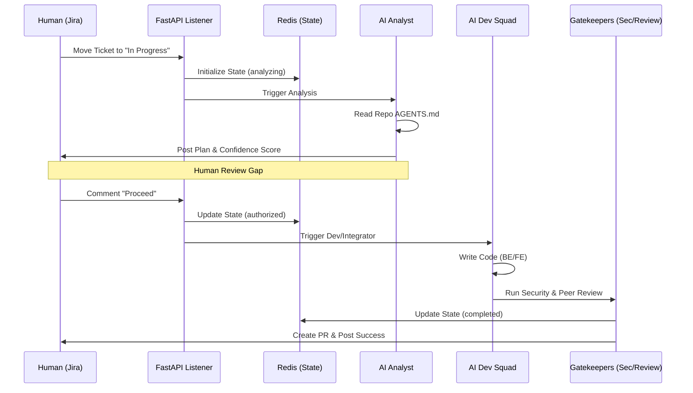

# 🏭 Agentic SDLC Factory (Full-Stack)

This is a localized, AI-driven development environment designed to automate the lifecycle of an E-commerce platform (Angular & Python) using a multi-repo agentic squad.

## 🚀 Overview
The Agentic SDLC Factory is a headless engineering team powered by DeepSeek-Coder-V2 and CrewAI. It monitors Jira for new tasks, analyzes requirements, implements code, performs security audits, and manages Git operations autonomously.

### Key Capabilities:
- **Multi-Repo Context:** Processes Full-Stack tickets by coordinating changes across Backend (FastAPI) and Frontend (Angular) repositories.
- **Self-Healing CI:** Automatically triggers a "Repair Task" if a test failure is detected in the CI/CD pipeline.
- **Safety Gates:** Integrated security scanning (Bandit/NPM Audit) and a "Human-in-the-loop" approval state via Jira comments.
- **Observability:** Full execution tracing using Arize Phoenix and real-time state tracking in Redis.


## 🏗️ 1. System Architecture & Workflow

The factory operates as a **State Machine** orchestrated by Redis and CrewAI.

### 📊 Operational Flow
1. **Trigger:** Human moves Jira ticket to **"In Progress"**.
2. **Analyze:** **Analyst Agent** reads repo-specific `AGENTS.md` and posts a **Confidence Score** + **Plan** to Jira.
3. **Wait:** Factory enters `awaiting_approval` state in Redis.
4. **Authorize:** Human comments **"Proceed"** on the ticket.
5. **Execute:** - **Backend Agent** writes Python logic.
    - **Frontend Agent** writes Angular components.
    - **Integrator Agent** ensures API contract synchronization.
6. **Verify:** **Security Agent** (Bandit/NPM Audit) and **Reviewer Agent** validate the work.
7. **Document:** **Doc Agent** updates `AGENTS.md` history.
8. **Finalize:** PR is created and state is marked `completed`.

---

## 🛠️ 2. Tech Stack
| Component | Technology |
| :--- | :--- |
| **LLM Engine** | Ollama (DeepSeek-Coder-V2:Lite) |
| **Orchestrator** | CrewAI |
| **State/Memory** | Redis |
| **Backend** | Python FastAPI + Postgres |
| **Frontend** | Angular 17+ (Standalone, Tailwind) |
| **Observability** | Arize Phoenix (Port 6006) |
| **Web Framework** | FastAPI (Jira Webhook Listener) |
| **Infrastructure** | Docker Compose |

---

## 📂 3. Project Structure
```text
.
├── /frontend              # Frontend Repo (Rules in AGENTS.md)
├── /backend               # Backend Repo (Rules in AGENTS.md)
├── /data                  # For LLM 
├── /ai-agents-core        # Factory Brain
│   ├── AGENTS.md          # Factory SOPs (Standard Operating Procedures)
│   ├── main.py            # CrewAI Squad Definition
│   └── requirements.txt   # Core Dependencies
│   └── .env               # Environment Variables
├── jira_listener.py       # FastAPI Webhook Gateway
├── docker-compose.yml     # Infrastructure (Profiles: 'default', 'ai')
└── README.md              # This file
```

### Environment Configuration
Create a `.env` file in the root directory:
```
JIRA_URL=https://your-domain.atlassian.net
JIRA_USER=your-email@example.com
JIRA_API_TOKEN=your-token
GITHUB_TOKEN=your-github-pat
OLLAMA_HOST=http://ollama:11434
PHOENIX_ENDPOINT=http://phoenix:4317
```

## 🚀 4. Setup Instructions (16GB RAM Optimized)
### Step 1: Launch Infrastructure
Run the app core and the AI factory using Docker profiles.

```
# Start E-commerce App
docker-compose up -d db backend-api frontend-ui

# Start AI Squad & Brain
docker-compose --profile ai up -d
```

### Step 2: Initialize the Brain
Download the specialized coding model into the local Ollama container:

```
docker exec -it ai-brain ollama pull deepseek-coder-v2:lite
```

### Step 3: Configure Environment
Create a .env file in ./ai-agents-core/:

```
JIRA_DOMAIN=yourdomain.atlassian.net
JIRA_USERNAME=your-email@example.com
JIRA_API_TOKEN=your-token
REDIS_HOST=redis
PHOENIX_HOST=http://phoenix:6006
```

## 🤖 5. Interacting with the Factory

### The "Confidence Score" Protocol
When the Analyst posts a report, look for the Confidence Score:

Score > 85%: Low risk. Safe to "Proceed".

Score 75% - 85%: Moderate risk. Review the "Technical Plan" carefully before proceeding.

Score < 75%: The AI is confused. Do not type "Proceed". Instead, provide more details in the Jira ticket description.

### The "AGENTS.md" Law
Each repo contains an AGENTS.md. This is the Source of Truth for the AI.

If you want the AI to use a specific library (e.g., ngx-charts), add it to the AGENTS.md of that repo.

If you change the database schema, update the Backend AGENTS.md.

## 📈 6. Monitoring & Troubleshooting
Real-time Thinking: View agent traces at http://localhost:6006.

Logs: Check container logs: docker logs -f ai-squad.

Redis State: Inspect current task state: docker exec -it ai-state redis-cli hgetall task:[YOUR-TICKET-ID].


# The System Architecture
## Operational Flow Diagram
This diagram shows how a Jira ticket transforms into verified code.



## Next Step for Team: 
- Ensure your Jira Webhooks are pointing to http://[YOUR-IP]:8000/webhook/jira

- Create a **JIRA** account and configure a **Webhook** inside.

- Generate a **GitHub Actions workflow** to automate the final deployment once the Reviewer Agent approves the PR.

- To avoid tracking git changes from `backend` and `frontend` directories: 

`git rm -r --cached backend/`
`git rm -r --cached frontend/`


## Important Commands: 

# Start E-commerce App
`docker-compose up -d db backend-api frontend-ui`

# Start AI Squad & Brain
`docker-compose --profile ai up -d`

# Initialize the Brain
`docker exec -it ai-brain ollama pull deepseek-coder-v2:lite`

# If you change something
`docker-compose up -d --build ai-squad`


# Phoenix 
http://localhost:6006/

# Ollama
http://localhost:11434/

# Jira Listener
http://localhost:8000/webhook/jira