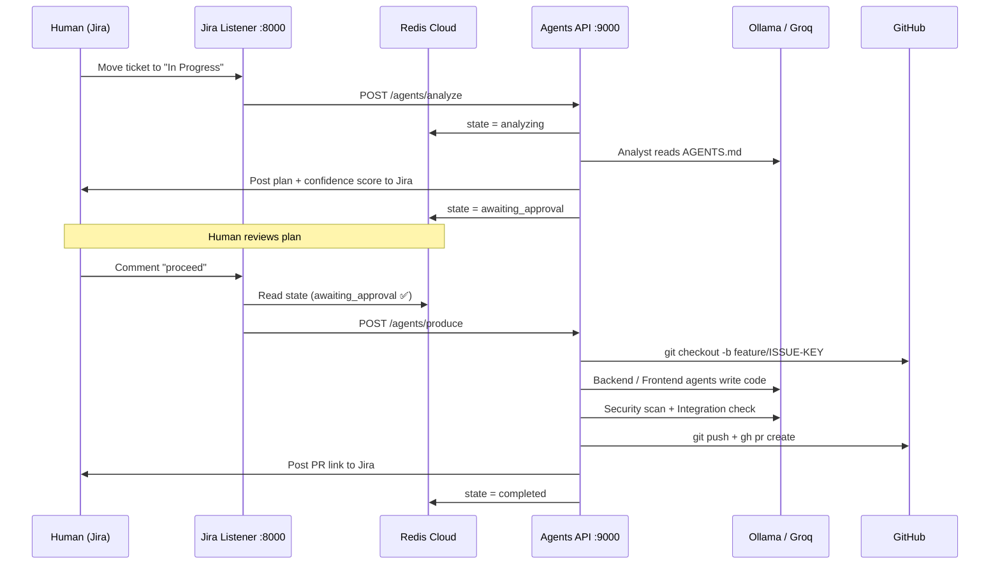

# 🏭 Agentic SDLC Factory

An AI-driven, headless engineering team that monitors Jira, analyzes requirements, writes code, runs security audits, creates branches, opens PRs, and manages the full SDLC — autonomously.

---

## 🏗️ Architecture

The project is split into **four independently deployable services** connected via HTTP and Redis Cloud.

```
Jira ──POST──▶  listener :8000  ──POST──▶  agents-api :9000  ──▶  Ollama (LLM)
                    │                           │
                    └── reads Redis Cloud       └── writes Redis Cloud
                                                └── calls Jira API
                                                └── pushes to GitHub
```

| Service | Directory | Purpose |
|---|---|---|
| **Jira Listener** | `listener/` | Receives Jira webhooks, delegates to agents-api |
| **Agents API** | root + `ai-agents-core/` | Runs all AI agents via CrewAI |
| **Ollama** | `ollama/` | Serves the LLM locally (no token limits) |
| **Phoenix** | `phoenix/` | Observability — traces every agent step and LLM call |

---

## 🛠️ Tech Stack

| Component | Technology |
|---|---|
| **Agent Orchestration** | CrewAI + LiteLLM |
| **LLM — Local** | Ollama (DeepSeek-Coder-V2:Lite) |
| **LLM — Cloud** | Groq / OpenAI (via `LLM_PROVIDER` env var) |
| **State Store** | Redis Cloud (free tier) |
| **Observability** | Arize Phoenix |
| **Webhook Receiver** | FastAPI |
| **Infrastructure** | Docker Compose |
| **Version Control** | GitHub CLI (`gh`) |

---

## 📂 Project Structure

```text
ai-sdlc-factory/
│
├── listener/               ← Standalone Jira webhook receiver
│   ├── jira_listener.py
│   ├── Dockerfile          (python:3.11-slim, minimal deps)
│   ├── docker-compose.yml
│   ├── requirements.txt
│   └── .env.sample         (REDIS_URL, AGENTS_API_URL)
│
├── ollama/                 ← Standalone LLM server
│   ├── Dockerfile
│   ├── init.sh             (auto-pulls model on first start)
│   ├── docker-compose.yml
│   └── .env.sample         (OLLAMA_MODEL)
│
├── phoenix/                ← Standalone observability server
│   ├── docker-compose.yml  (uses official arizephoenix/phoenix image)
│   └── .env.sample
│
├── ai-agents-core/         ← Agent logic
│   ├── agents_api.py       (FastAPI — POST /agents/analyze, /agents/produce)
│   ├── main.py             (AIFactory + all CrewAI agents)
│   └── tools/
│       ├── jira_tools.py
│       └── shell_tool.py
│
├── Dockerfile              (agents-api image)
├── docker-compose.yml      (agents-api + db only — all infra services are external)
├── entrypoint.sh           (gh auth + repo clone on startup)
└── .env.sample
```

---

## 🔄 State Machine

```
Jira → "In Progress"
    └──▶ analyzing
             └──▶ awaiting_approval   ← plan posted to Jira, waits for human

Human comments "proceed"
    └──▶ branching_{context}          ← git checkout -b feature/ISSUE-KEY
             └──▶ coding_{context}
                      └──▶ integrating_{context}
                               └──▶ security_scanning_{context}
                                        └──▶ reviewing_{context}   ← commit + push + PR
                                                 └──▶ completed_{context}
```

---

## 🤖 AI Agents

| Agent | Role |
|---|---|
| **Analyst** | Reads AGENTS.md, produces technical plan + confidence score |
| **Backend Developer** | Implements FastAPI + SQLAlchemy changes |
| **Frontend Developer** | Implements Angular standalone components |
| **Integration Specialist** | Verifies API contract between backend and frontend |
| **SecOps** | Runs Bandit (Python) and npm audit (Node) |
| **Git Manager** | Creates branches, commits, pushes, opens PRs |
| **Doc Architect** | Updates AGENTS.md history |
| **Reviewer** | Final quality gate, posts PR link to Jira |

---

## 🚀 Setup

### Prerequisites
- Docker Desktop
- Redis Cloud free tier account → [redis.io/try-free](https://redis.io/try-free)
- Groq API key (if not using local Ollama) → [console.groq.com](https://console.groq.com)

### Step 1 — Configure environment

```bash
cp .env.sample .env
# Fill in: REDIS_URL, GITHUB_TOKEN, JIRA_*, GIT_USER_*, OLLAMA_HOST or GROQ_API_KEY
```

### Step 2 — Start Ollama (local LLM, optional)

```bash
cd ollama && cp .env.sample .env
docker-compose up -d --build
# First run downloads deepseek-coder-v2:lite (~9GB) — subsequent starts are instant
```

### Step 3 — Start Phoenix (observability, optional)

```bash
cd phoenix && docker-compose up -d
# UI available at http://localhost:6006
# Set PHOENIX_ENDPOINT=http://localhost:4317 in root .env
# Leave PHOENIX_ENDPOINT blank to skip tracing (e.g. on Hugging Face)
```

### Step 4 — Start the AI agents

```bash
# From project root
docker-compose --profile ai up -d --build
```

### Step 5 — Start the Jira listener

```bash
cd listener && cp .env.sample .env
# Set REDIS_URL and AGENTS_API_URL in listener/.env
docker-compose up -d --build
```

### Step 6 — Configure Jira Webhook

In Jira → **Settings → System → Webhooks**, create a webhook:
- **URL:** `http://<your-host>:8000/webhook/jira`
- **Events:** Issue updated, Comment created

---

## ☁️ Hugging Face Deployment

Each service deploys as a separate HF Space:

| Space | Directory | Port | Notes |
|---|---|---|---|
| `your-org/ai-sdlc-listener` | `listener/` | 8000 | Always on |
| `your-org/ai-sdlc-agents` | root | 9000 | Always on |
| `your-org/ai-sdlc-ollama` | `ollama/` | 11434 | Optional — use Groq instead |
| `your-org/ai-sdlc-phoenix` | `phoenix/` | 6006 | Optional — use Arize Cloud instead |

> **Phoenix on HF:** leave `PHOENIX_ENDPOINT` blank to disable tracing, or use [Arize Phoenix Cloud](https://app.phoenix.arize.com) (free) and set `PHOENIX_ENDPOINT=https://app.phoenix.arize.com/v1/traces` + `PHOENIX_API_KEY`.

**Required HF secrets for agents Space:**
```
REDIS_URL          rediss://default:<pwd>@<host>:<port>
GITHUB_TOKEN       PAT with repo scope
JIRA_DOMAIN        yourorg.atlassian.net
JIRA_USERNAME      your@email.com
JIRA_API_TOKEN     your-jira-token
GIT_USER_NAME      Your Name
GIT_USER_EMAIL     your@email.com
BACKEND_REPO_URL   https://github.com/your-org/backend.git
FRONTEND_REPO_URL  https://github.com/your-org/frontend.git
OLLAMA_HOST        https://your-org-ai-sdlc-ollama.hf.space
LLM_PROVIDER       ollama
```

> **No Ollama Space?** Use Groq instead: set `LLM_PROVIDER=groq`, `LLM_MODEL=llama-3.3-70b-versatile`, `GROQ_API_KEY=...`

---

## 📈 Monitoring

| Resource | URL |
|---|---|
| Phoenix traces | http://localhost:6006 |
| Ollama API | http://localhost:11434 |
| Agents API | http://localhost:9000/health |
| Jira Listener | http://localhost:8000/webhook/jira |

**Container logs:**
```bash
docker logs -f agents-api
docker logs -f jira-listener
docker logs -f ai-brain
```

**Redis state inspection:**
```bash
# Requires redis-cli pointed at your Redis Cloud instance
redis-cli -u $REDIS_URL hgetall task:ISSUE-KEY
```

---

## 🧠 The "Confidence Score" Protocol

The Analyst agent posts a score with every plan:

| Score | Meaning | Action |
|---|---|---|
| > 85% | Low risk | Safe to comment `proceed` |
| 75–85% | Moderate risk | Review the plan carefully first |
| < 75% | AI is uncertain | Add more detail to the Jira ticket, do NOT proceed |

---

## 📜 The AGENTS.md Law

Each product repo contains an `AGENTS.md`. This is the **source of truth** for the AI agents — it defines libraries, patterns, constraints, and history.

- Want the AI to use `ngx-charts`? Add it to `frontend/AGENTS.md`.
- Changed the database schema? Update `backend/AGENTS.md`.
- Every completed task is logged in the AGENTS.md history by the Doc Agent.

---

## 🔧 Useful Commands

```bash
# Rebuild agents after a code change
docker-compose --profile ai up -d --build agents-api

# Rebuild listener after a code change
cd listener && docker-compose up -d --build

# Rebuild Ollama (e.g. to change model)
cd ollama && docker-compose up -d --build

# Start / stop Phoenix
cd phoenix && docker-compose up -d
cd phoenix && docker-compose down

# Stop agents
docker-compose --profile ai down

# Validate environment before starting
bash docker-compose.check.sh
```

---

## 📊 Flow Diagram


